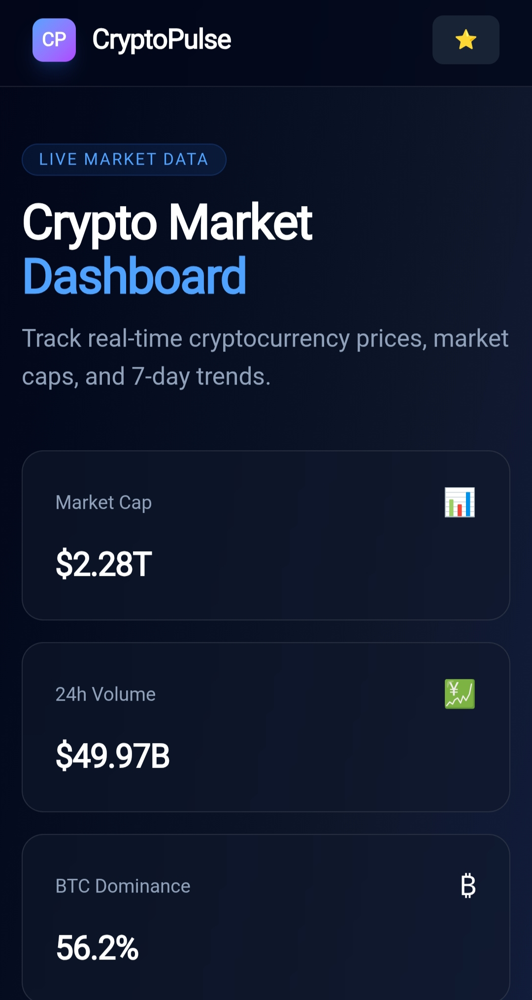
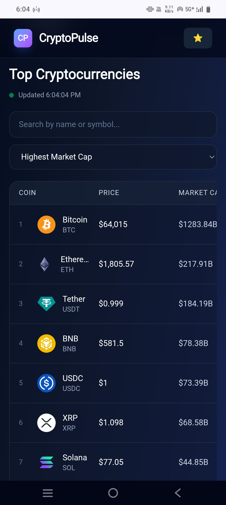
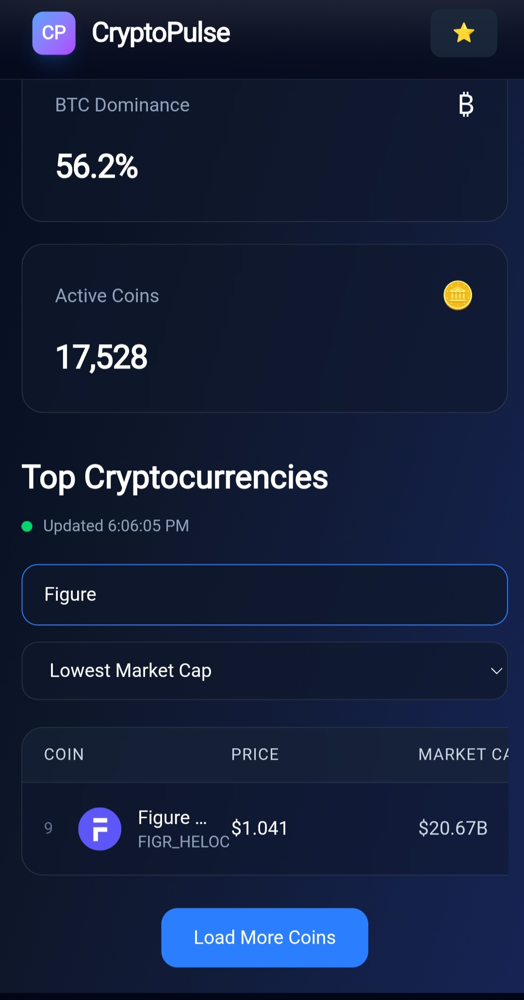

# 🚀 CryptoPulse - Crypto Price Dashboard

A modern cryptocurrency tracking dashboard built with React, TypeScript, and Vite.

CryptoPulse provides real-time cryptocurrency market data, price tracking, watchlists, and a clean responsive interface for crypto users.

## 🌟 Features

- 📊 Real-time cryptocurrency prices
- 🔍 Search cryptocurrencies
- ⭐ Add coins to watchlist
- 📈 Market statistics
- 💾 Persistent watchlist using local storage
- 📱 Fully responsive UI
- ⚡ Fast performance with Vite

## 🛠 Tech Stack

### Frontend
- React
- TypeScript
- Vite
- Tailwind CSS

### API
- CoinGecko API

### Tools
- Git & GitHub
- Vercel

## 📸 Screenshots

### Dashboard



### Cryptocurrency Table



### Search & Sorting



## 🚀 Installation

Clone the repository:

```bash
git clone https://github.com/Avikr11/crypto-price-dashboard.git
